# Teach

A project that I created for people who have just got their PHD to be able to teach to a public university of Greece. The project is called "πρόγραμμα απόκτησης ακαδημαϊκής εμπειρίας" (academic experience program).

<!-- TABLE OF CONTENTS -->
## Table of Contents

- [How to use](#how-to-use)
- [How To Install](#how-to-install)

## How to use

This app is a web app for applications submitting and online reviewing.

It was designed for a project called Απόκτησης Ακαδημαϊκής Εμπειρίας for the greek universities but can actually be used for any similar use case.

- The candidates submit their application and can download and/or print the submission result
- the reviewers can grade the applications and automatically a report card is generated.
- The administrators of the platform have full oversight over the process in an easy to understand way

At first, we can see info about the app and the requirements to apply. Also, we can see more info about each available field so that the candidates can be properly informed
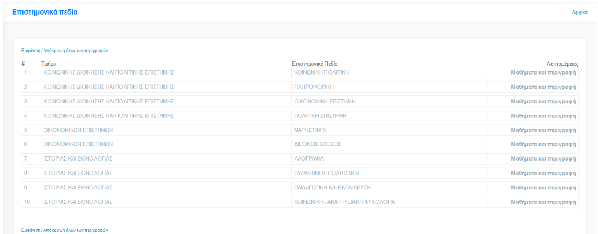
*"Fields of Science" summary view*

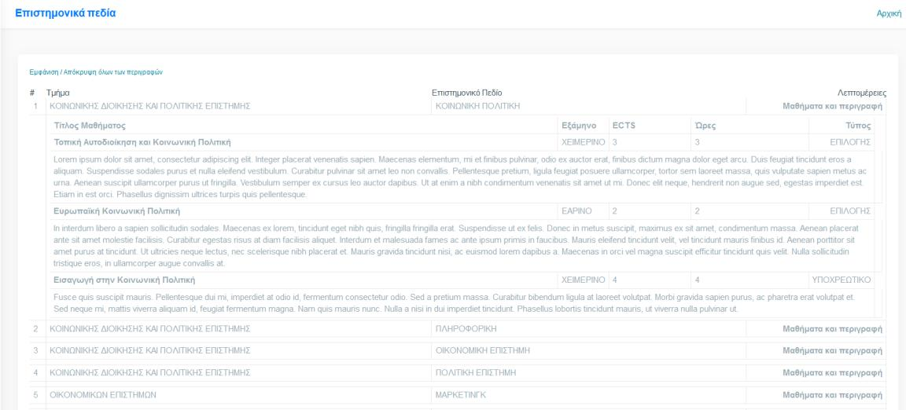
*More info on each field*

### Submit
In the submit section the user must complete four forms to get his application submitted.

1. His personal data that will be used to contact him for further notice if he gets accepted.
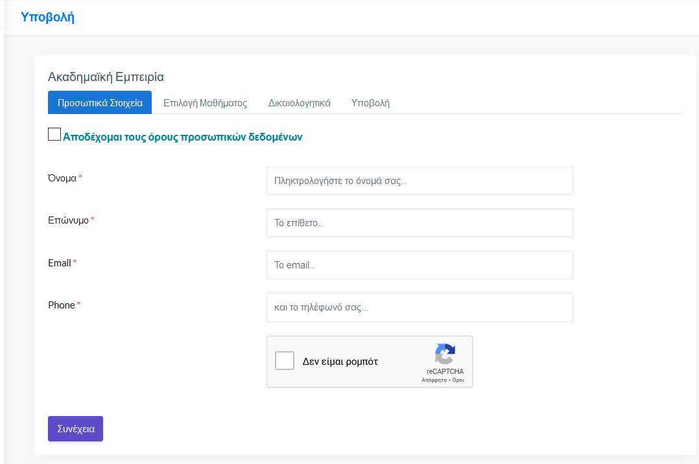
1. Selecting the scientific field that he is interested in
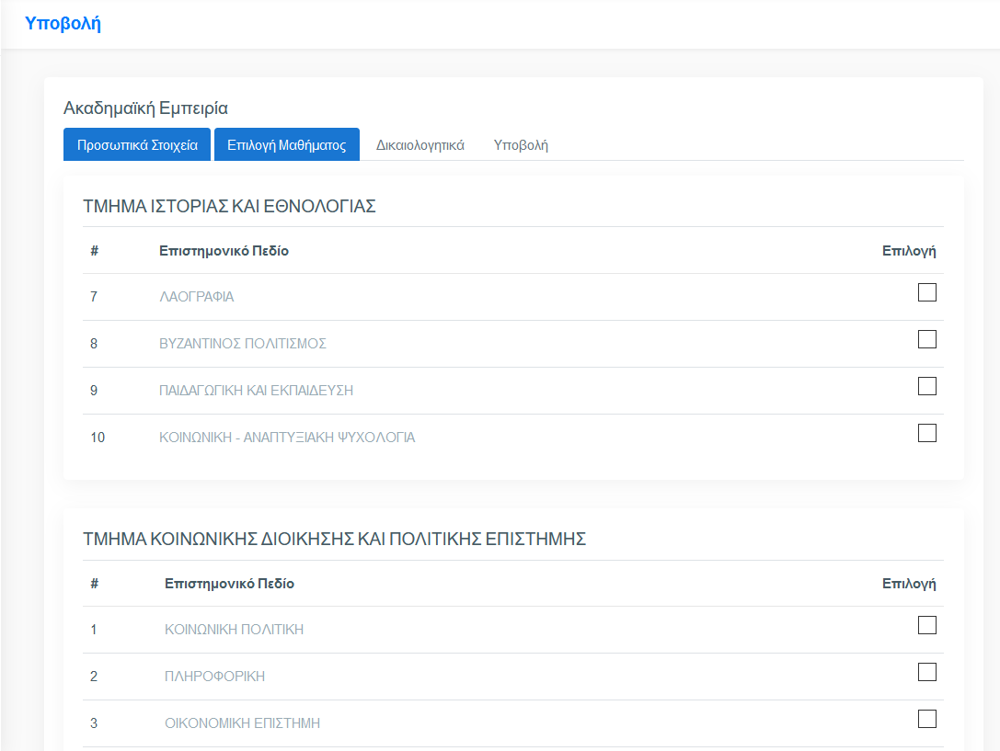
1. Submit supporting documents
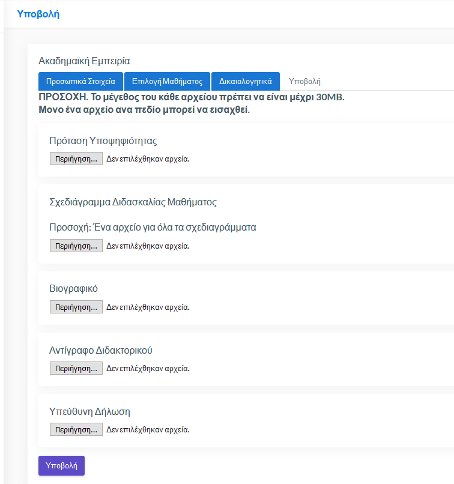
1. Verify and final submission
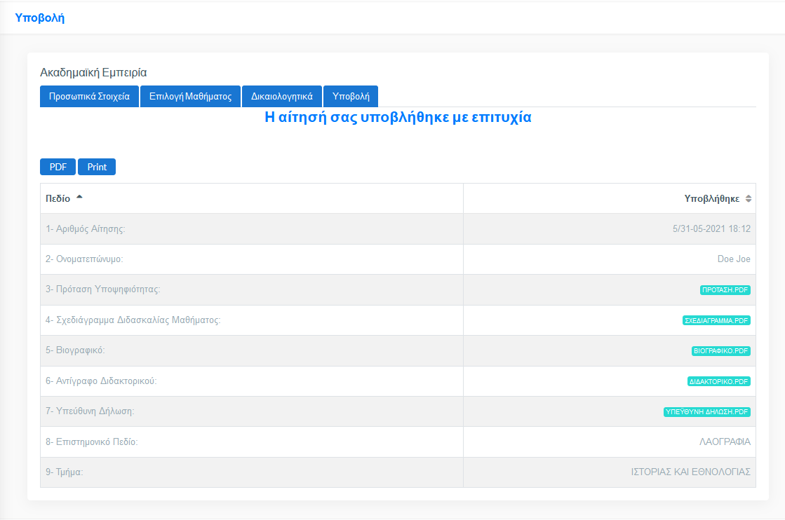

### Review
In this specific project, each submission is graded by three evaluators. Each grader has
access to the documents attached by each candidate. Scoring fields can be pass/fail criteria and scoring fields with a different factor per field.

1. Select candidate to grade 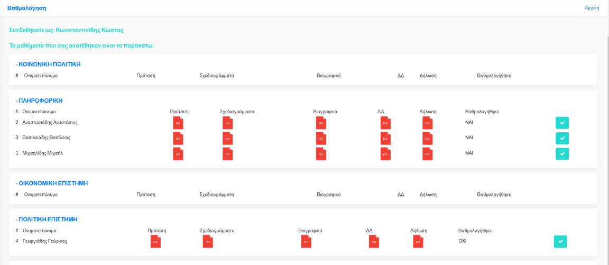
1. Grade pass/fail options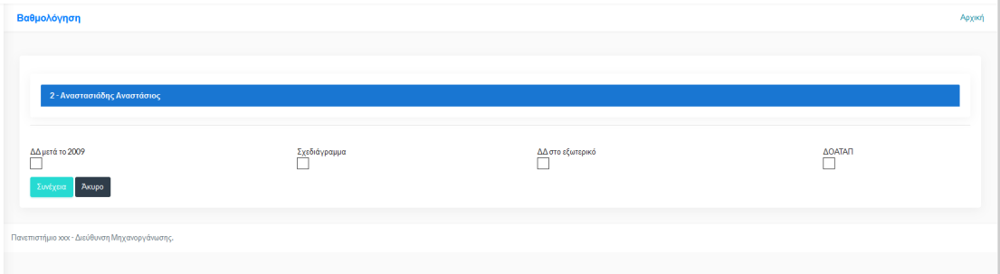
1. Grading the candidate 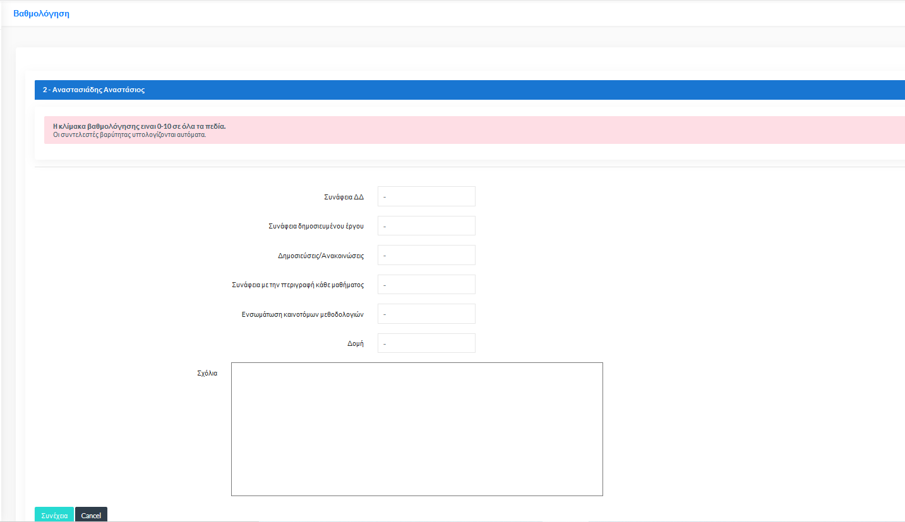
1. The rating scale from the evaluators is 0-10 for all fields and the weighting factor
is included by the program when calculating each candidate's final score.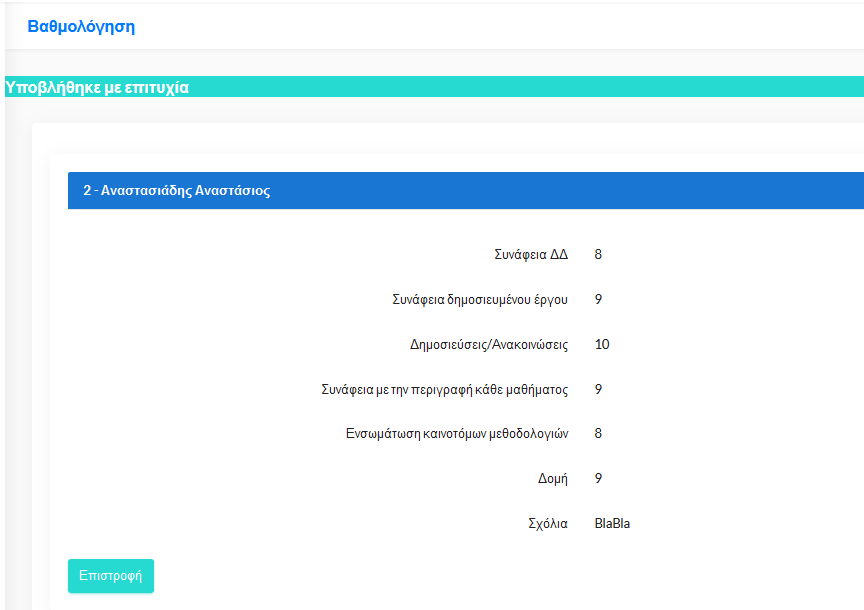
*finish grading by applying the scores*

### After the review

1. After the review is over there is an email sent to all administrators 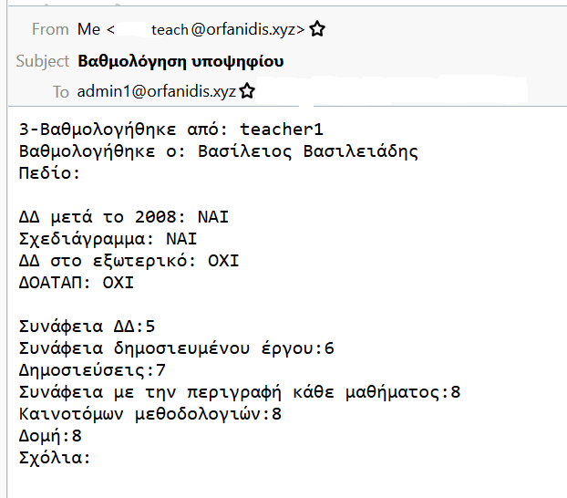

1. When all candidates of a scientific field have been graded, then an assessment report is produced in pdf format which is printed by the first assessor, as the chairman of the committee.

### Administration

1. `General screen view`: The first page displays general information such as:
    1. the number of active scientific fields,
    1. the number of applications for the scientific fields for which no application was submitted and
    1. applicationsthat the scoring process was completed.
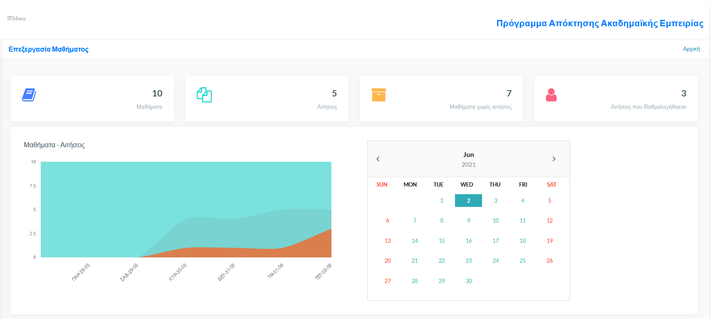
1. The Applications section displays information about submitted applications and applicants. From this section, the status of an application can be changed to "Active/Inactive".
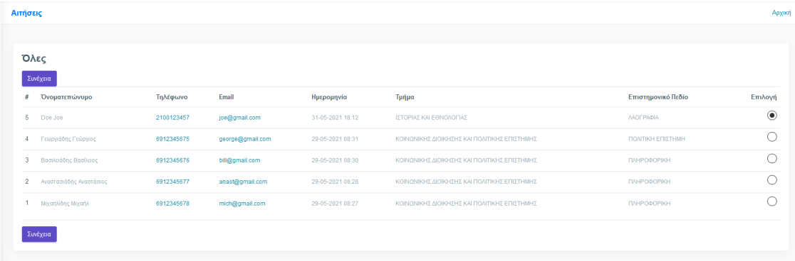
*General Info*
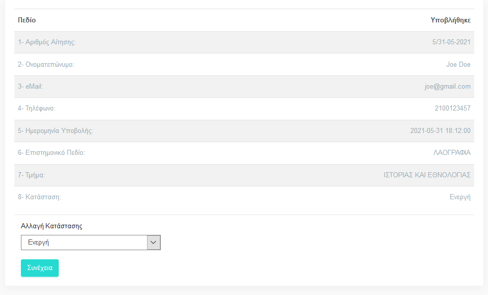
*Cange Application Status*
1. The "Courses" section displays submitted applications by scientific field. Fields for which at least one application has been submitted are labeled with green color and fields for which no application has been submitted are labeled with red color
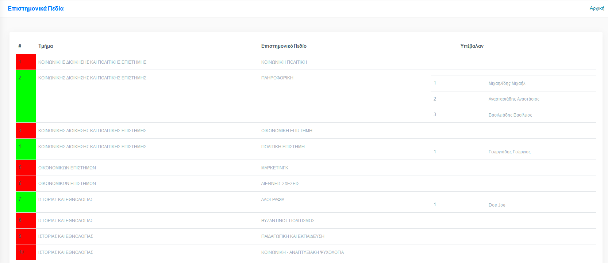
1. The Graded section shows the status of the scientific fields in terms of grading.
Fields in which no applications have been submitted are shown in red, fields for which applications have been submitted but the grading process has not been completed are shown in yellow and in green fields in which the grading process has been completed.
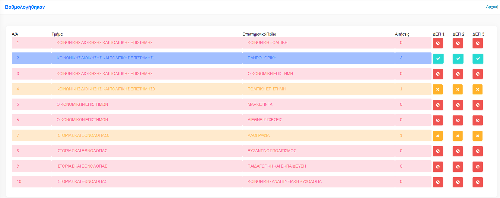
1. Additionally, selecting a grader icon displays their details (name, phone, email).
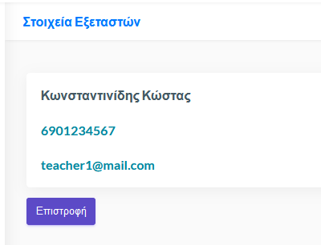
1. Selecting the email address sends an automated message to the grader, while selecting the phone the phone number is called (only works with Cisco Call Manager – Click to call).
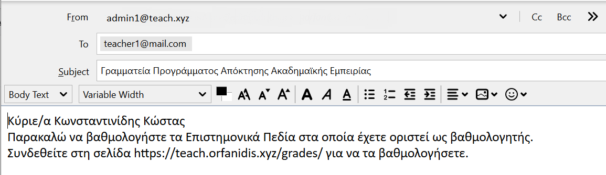
1. The "Course Editing" section is about changing/entering science information
fields.
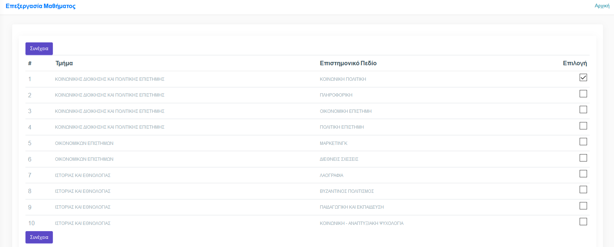
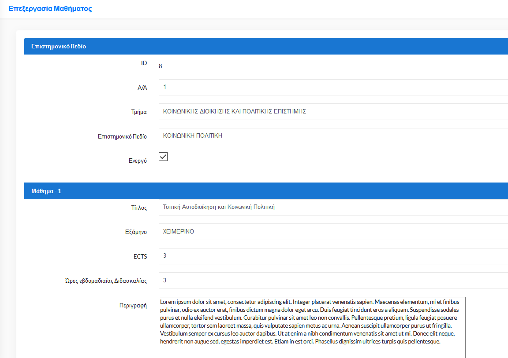
1. Finally, the 'History' section shows the changes that have been made to the candidate's scoring.
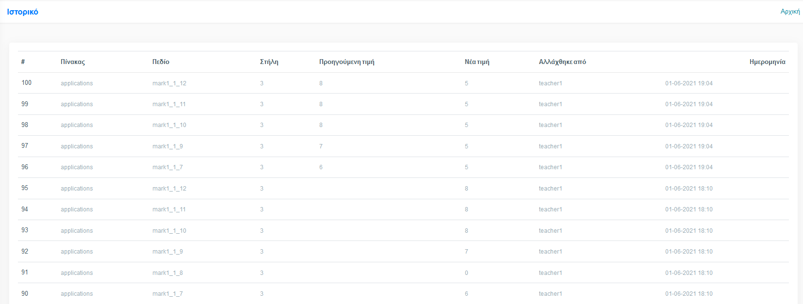


## How to install
To install the app on your web server, you need to have a Linux operating system. (I have not tested it on windows).

### Requirements:
    
- Web server (recommended: apache)
    - the Apache module include(`a2enmod include.load`)
- PHP
    - `php-mbstring`
- MySQL
- wkhtmltopdf to convert the result into pdf
```bash
wget https://github.com/wkhtmltopdf/packaging/releases/download/0.12.6-1/wkhtmltox_0.12.6-1.focal_amd64.deb

sudo apt install ./wkhtmltox_0.12.6-1.focal_amd64.deb
```

- For creating the captcha you need to follow the relevant instructions [here](https://www.google.com/recaptcha/admin)


### Set Up
1. Create a database and the user to use with this app.
1. Open the script [tables.sql](./tables.sql) and change th first line to use the database you created 
1. Run the script [tables.sql](./tables.sql) to automatically create the tables
```bash 
mysql -u username -p -h localhost -P 3306 < create_tables.sql
```
> Remember to replace username with the username you provided at the first step
4. Change the following files:
    - `www` folder:
        - `config` folderss
            - `config.inc.php`: Contains the configuration for the captcha, the database and if an ldap is to be used, it also contains info about the ldap
            - `admin.php`: It contains a list with the admin emails for notifications.
        - `myUniversity`:
            - `el.inc.php`: Messages in Greek
            - `firstPage.txt`: Message for the first page.
            - `myInfo.txt`: Message for the info page (`Πληροφορίες`)
            - `myConditions.txt`: Message for the conditions page (`Προϋποθέσεις`)
            - `contact.txt`: message for the contact page
            - `gdpr.txt`: the gdpr text
            - `report.php`: The weighting factors of the scoring fields and the parameters of the text of the report grading.
            - `logo.png`: The logo of the institution
        - `auth`
            > for the authentication, the app uses an `auth.php` file. So, you need to rename one of the following files to `auth.php`
            - `auth.local.php`: Authenticating using the local database
            - `auth.ldap.php`: Authenticating using the ldap server
        > In several parts of the app you will have to change the name and/or email for the exminer. Based on the authentication method that you have chosen, you will be required to make changes to the following files:
        > 1. /admins/rated/index.php
        > 1. /grades/index.php
        > 1. /private/results2.php
        > 1. /results/index.php
        - `documents`:
            
            In that folder the app uploads the data of the users that apply for the project.
        - `ektyposeis`: This directory contains the result for the project. This must be printed and stored.
    - `scripts`:
        - `graphs.sh`:
        
        In order to refresh the values for the graph we need to execute the script called `graphs.sh` regularly. You can use crontab to do that by placing a command such as:
        ```bash
        0 * * * * root /var/ww/teach/scripts/graphs.sh
        ```
        > The path should point to the directory you have actually placed the `graphs.sh` script


### Inserting multiple study fields at the same time
To insert multiple study fields we have to create the file `/var/lib/mysql-files/Lessons.txt` using the following format:


| Id | Lesson                             |
|:--- |---:                               |
| 1   |Lesson code                        |
| 2   |course                             |
| 3   |Title of study field               |
| 4   |Course-1 Title                     |
| 5   |Course-1 Semester                  |
| 6   |Course-1 ECTS                      |
| 7   |Course-1 total hours               |
| 8   |Course-1 Type (Mandatory/ elective)|
| 9   |Course-1 Description               |
| 10  |Course-2 Title                     |
| 11  |Course-2 Semester                  |
| 12  |Course-2 ECTS                      |
| 13  |Course-2 total hours               |
| 14  |Course-2 Type (Mandatory/ elective)|
| 15  |Course-2 Description               |
| 16  |Course-3 Title                     |
| 17  |Course-3 Semester                  |
| 18  |Course-3 ECTS                      |
| 19  |Course-3 total hours               |
| 20  |Course-3 Type (Mandatory/ elective)|
| 21  |Course-3 Description               |
| 22  |Username Examiner 1                |
| 23  |Username Examiner 2                |
| 24  |Username Examiner 3                |
| 25  |The word «END»                     |


Then, we execute the script named `lessons.sh` at the folder `scripts` after we change the credentials and/or the database name on that script so that the data can be successfully loaded to the database.


<!--
Επίσης, υπάρχει πλήρες λειτουργικό demo στην σελίδα [teach.orfanidis.xyz](https://teach.orfanidis.xyz)
-->